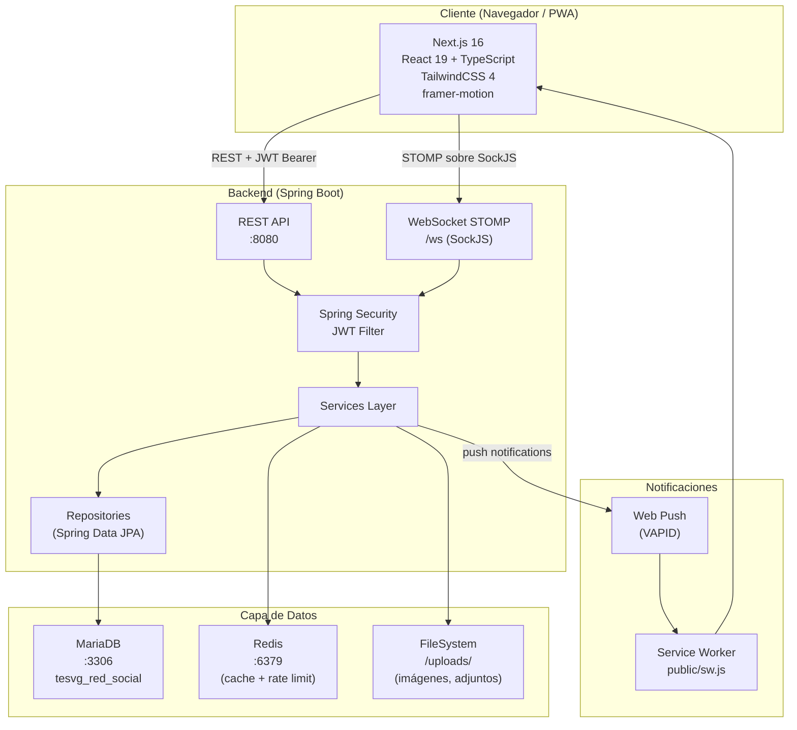

# Arquitectura General de FalconNet

## Diagrama General

## Separación de Responsabilidades

| Capa | Tecnología | Puerto | Responsabilidad |
|---|---|---|---|
| Frontend | Next.js 16 | 3000 | UI, routing, estado cliente |
| Backend | Spring Boot | 8080 | API REST, auth, lógica de negocio |
| Base de datos | MariaDB | 3306 | Persistencia |
| Cache | Redis | 6379 | Cache, rate limiting, presencia |
| Archivos | FileSystem | — | Imágenes, adjuntos, avatares |
| Push | VAPID/Web Push | — | Notificaciones del navegador |

## Principio Fundamental

> El frontend (Next.js) y el backend (Spring Boot) son **completamente separados**. Spring Boot es API pura — no sirve HTML. Next.js es el único frontend.

Esta separación se completó en mayo 2026, migrando desde una arquitectura monolítica donde Spring Boot servía HTML/JS directamente.

## Comunicación Frontend → Backend

1. **REST HTTP** — todas las operaciones CRUD
2. **WebSocket STOMP** — (futuro) mensajes en tiempo real
3. **Push Notifications** — vía Service Worker, notificaciones background

## Configuración CORS

El backend acepta orígenes de:
- `localhost:3000`, `localhost:3001`, `localhost:8080`
- Rangos `192.168.*.*`, `10.*.*.*`, `172.16.*.*` (red local)

Ver: [[Stack-Tecnologico]] | [[Flujo-JWT]]
