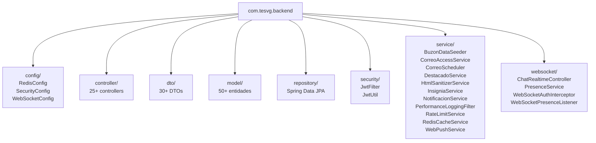

# Estructura del Backend

## Diagrama de Paquetes



## Controllers Principales

| Controller | Ruta Base | Módulo |
|---|---|---|
| `UsuarioController` | `/usuarios` | Auth, perfiles |
| `PublicacionController` | `/publicaciones` | Feed |
| `ComentarioReaccionController` | `/interacciones` | Reacciones, comentarios |
| `SeguidorController` | `/seguidores` | Followers |
| `MensajeController` | `/mensajes` | Chat DM |
| `ChatGrupoController` | `/chat-grupos` | Chat grupos |
| `CorreoController` | `/correos` | Correo institucional |
| `MarketController` | `/market` | Marketplace |
| `GrupoController` | `/grupos` | Grupos sociales |
| `NotificacionController` | `/notificaciones` | Notificaciones |
| `PushController` | `/push` | Push subscriptions |
| `StoryController` | `/stories` | Stories |
| `EventoController` | `/eventos` | Eventos |
| `AvisoController` | `/avisos` | Avisos institucionales |
| `RecursoController` | `/recursos` | Recursos educativos |
| `RankingController` | `/ranking` | Ranking estudiantil |
| `BuscadorController` | `/buscar` | Búsqueda global |
| `AdminController` | `/admin` | Panel de admin |
| `ImagenController` | `/imagenes` | Upload/serve archivos |
| `InsigniaController` | `/insignias` | Insignias/badges |
| `EncuestaController` | `/encuestas` | Encuestas |
| `DestacadoController` | `/destacados` | Contenido destacado |
| `ReclutamientoController` | `/reclutamiento` | Reclutamiento |
| `ChatRealtimeController` | WebSocket | Realtime STOMP |

## Entidades Principales (model/)

### Usuarios y Perfiles
- `Usuario` — entidad base de usuario
- `Seguidor` — relación seguidor/seguido
- `Insignia`, `UsuarioInsignia` — sistema de badges

### Feed
- `Publicacion` — posts del feed
- `Like` — likes en publicaciones
- `Comentario` — comentarios
- `ComentarioReaccion` — reacciones en comentarios
- `Story`, `StoryViewer` — stories

### Chat (DM)
- `Mensaje` — mensajes directos
- `MessageReaction` — reacciones en mensajes
- `DMConversationPreference` — preferencias de conversación
- `DMMessageHidden` — mensajes ocultados
- `ChatBlock` — bloqueos de chat
- `ChatReport` — reportes
- `ChatAuditLog` — auditoría

### Chat (Grupos)
- `ChatGrupo` — grupo de chat
- `ChatGrupoMiembro` — miembros del grupo
- `ChatGrupoMensaje` — mensajes del grupo
- `ChatGrupoMensajeOculto` — mensajes ocultos
- `ChatGroupRole` — roles del grupo
- `GroupAttachment` — archivos del grupo

### Correo
- `Correo` — email institucional
- `CorreoDestinatario` — destinatarios
- `CorreoAdjunto` — adjuntos
- `CorreoEtiqueta` — etiquetas
- `BuzonOficial` — buzones institucionales
- `BuzonMiembro` — miembros de buzón

### Social
- `GrupoSocial` — grupos/comunidades
- `GrupoMiembro` — miembros del grupo
- `GrupoPublicacion` — publicaciones del grupo
- `Notificacion` — notificaciones del sistema
- `PushSubscription` — suscripciones push
- `Favorito` — favoritos (correos/mensajes)
- `Destacado` — contenido destacado

### Marketplace
- `Producto` — productos en venta
- `SolicitudCompra` — solicitudes de compra

### Institucional
- `Evento` — eventos académicos
- `Aviso` — avisos institucionales
- `Recurso` — recursos educativos
- `Encuesta`, `EncuestaOpcion`, `EncuestaVoto` — encuestas
- `Reclutamiento`, `SolicitudReclutamiento` — reclutamiento
- `CodigoRegistro` — códigos de acceso
- `Reporte` — reportes de contenido
- `DMMessageReaction` — reacciones DM

## Servicios Clave

| Servicio | Responsabilidad |
|---|---|
| `WebPushService` | Envío de notificaciones push VAPID |
| `NotificacionService` | Lógica de notificaciones del sistema |
| `CorreoAccessService` | Control de acceso a correos por usuario |
| `CorreoScheduler` | Tareas programadas del correo |
| `HtmlSanitizerService` | Sanitización HTML de correos |
| `RateLimitService` | Rate limiting via Redis |
| `RedisCacheService` | Cache genérico Redis |
| `InsigniaService` | Otorgamiento de insignias |
| `DestacadoService` | Gestión de contenido destacado |
| `PerformanceLoggingFilter` | Logging de tiempos de respuesta |
| `BuzonDataSeeder` | Seed de buzones oficiales iniciales |

## WebSocket (STOMP)

```
/ws (SockJS endpoint)
├── WebSocketAuthInterceptor — valida JWT en handshake
├── PresenceService — trackea usuarios conectados
├── WebSocketPresenceListener — eventos connect/disconnect
└── ChatRealtimeController — mensajes STOMP
    ├── /app/chat.dm — mensajes DM
    ├── /app/chat.group — mensajes de grupo
    └── /topic/user.{id} — canal personal
```

> **Nota:** El frontend actual usa WebSocket nativo (no STOMP). La migración a `@stomp/stompjs` es Fase 4.

Ver: [[02-Backend/Endpoints-API|Endpoints API Completos]] | [[02-Backend/DTOs-Principales|DTOs Principales]]
