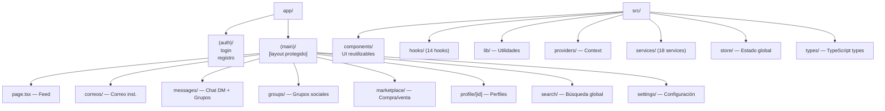

# Estructura del Frontend

## Diagrama de Arquitectura Frontend



## Rutas de la Aplicación

### Rutas Públicas (auth)
| Ruta | Descripción |
|---|---|
| `/login` | Inicio de sesión |
| `/registro` | Registro de usuario |

### Rutas Protegidas (main)
| Ruta | Descripción |
|---|---|
| `/` | Feed principal |
| `/correos` | Correo institucional |
| `/messages` | Lista de chats DM |
| `/messages/[userId]` | Hilo de chat con usuario |
| `/messages/groups/[groupId]` | Chat de grupo |
| `/groups` | Grupos/comunidades |
| `/groups/[id]` | Detalle de grupo |
| `/marketplace` | Marketplace estudiantil |
| `/profile/[id]` | Perfil público |
| `/search` | Búsqueda global |
| `/settings` | Configuración |
| `/avisos` | Avisos institucionales |
| `/eventos` | Eventos académicos |
| `/recursos` | Recursos educativos |
| `/ranking` | Ranking estudiantil |
| `/equipos` | Equipos/proyectos |
| `/admin` | Panel de administración |
| `/create` | Crear publicación |

## Services (API Layer — src/services/)

| Servicio | Descripción |
|---|---|
| `api.ts` | Cliente HTTP base con JWT |
| `auth.service.ts` | Login, registro, perfil |
| `post.service.ts` | CRUD publicaciones |
| `comment.service.ts` | CRUD comentarios |
| `reaction.service.ts` | Reacciones en posts |
| `comment-reaction.service.ts` | Reacciones en comentarios |
| `user.service.ts` | Usuarios, seguidores |
| `chat.service.ts` | Chat DM |
| `groupChat.service.ts` | Chat grupos |
| `group.service.ts` | Grupos sociales |
| `marketplace.service.ts` | Marketplace |
| `notification.service.ts` | Notificaciones |
| `story.service.ts` | Stories |
| `search.service.ts` | Búsqueda global |
| `equipo.service.ts` | Equipos |
| `destacado.service.ts` | Contenido destacado |

## Custom Hooks (src/hooks/)

| Hook | Responsabilidad |
|---|---|
| `useAuth` | Usuario actual, login/logout |
| `useApi` | Wrapper de peticiones API |
| `useFeed` | Feed con paginación infinita |
| `useSocket` | Conexión WebSocket |
| `useRealtime` | Eventos realtime |
| `useUnreadCounts` | Badges no leídos (polling 30s) |
| `usePresence` | Estado online de usuarios |
| `useTheme` | Dark/light mode |
| `useToast` | Notificaciones toast |
| `useBreakpoint` | Responsive breakpoints |
| `useIsMobile` | Detección mobile |
| `useDebounce` | Debounce para inputs |
| `useIntersection` | Intersection Observer |
| `useLocalStorage` | Storage persistente |

## Tipos Principales

### types/index.ts (891 líneas)
- `BUser` — usuario del backend (raw)
- `User` — usuario normalizado para UI
- `BPublicacion` / `Post` — publicaciones
- `BComentario` — comentarios
- `Message` — mensaje de chat DM
- `ChatGroup` — grupo de chat
- `GroupMessage` — mensaje de grupo
- `Notification` — notificación del sistema
- `SocialUser` — usuario de grupos sociales
- `GroupAttachment` — adjunto de grupo

### types/realtime.types.ts
```typescript
const RT = {
  CHAT_MESSAGE:  'chat:message',
  CHAT_TYPING:   'chat:typing',
  CHAT_READ:     'chat:read',
  NOTIFICATION:  'notification:new',
  PRESENCE:      'presence:update',
  POST_REACTION: 'post:reaction',
  POST_COMMENT:  'post:comment',
}
```

## Convenciones

- **Mobile-first** obligatorio
- **TypeScript estricto** — `no any`
- **Server components** donde sea posible
- **Lazy loading** en componentes pesados
- No mezclar correo y chat en mismos componentes
- Dark mode con variables CSS del sistema de diseño

Ver: [[03-Frontend/Frontend-Overview]] | [[Stack-Tecnologico]]
