# Flujo de Autenticación JWT

## Diagrama de Flujo

```mermaid
sequenceDiagram
    participant U as Usuario
    participant FE as Next.js Frontend
    participant BE as Spring Boot API
    participant DB as MariaDB

    rect rgb(30, 50, 80)
        Note over U,DB: LOGIN
        U->>FE: Ingresa correo + password
        FE->>BE: POST /usuarios/login<br/>{ correo, password }
        BE->>DB: Busca usuario por correo
        DB-->>BE: Usuario encontrado
        BE->>BE: Valida password (BCrypt)
        BE->>BE: Genera JWT (JJWT 0.11.5)
        BE-->>FE: { token, usuario: UsuarioResponse }
        FE->>FE: Guarda token en localStorage/cookie
        FE->>U: Redirige al feed
    end

    rect rgb(30, 60, 40)
        Note over U,DB: REQUEST AUTENTICADO
        U->>FE: Navega / hace acción
        FE->>FE: Lee token del storage
        FE->>BE: GET /publicaciones<br/>Authorization: Bearer <token>
        BE->>BE: JwtFilter intercepta
        BE->>BE: Valida firma JWT
        BE->>BE: Extrae userId del payload
        BE->>DB: Consulta datos
        DB-->>BE: Datos
        BE-->>FE: Response JSON
        FE->>U: Muestra datos
    end

    rect rgb(80, 30, 30)
        Note over U,DB: REGISTRO
        U->>FE: Llena form de registro
        FE->>BE: POST /usuarios/registro<br/>{ correo, password, username, codigoAcceso? }
        BE->>DB: Crea usuario
        DB-->>BE: Usuario creado (SIN token)
        BE-->>FE: UsuarioResponse (SIN token)
        FE->>BE: POST /usuarios/login (auto-login)
        BE-->>FE: { token, usuario }
        FE->>U: Usuario logueado
    end
```



## Detalles de Implementación

### Backend — JwtUtil.java
- Librería: JJWT 0.11.5
- Algoritmo: HS256 (HMAC-SHA256)
- Secret: env var `JWT_SECRET` (default en dev: `mi_clave_super_secreta_...`)
- Payload incluye: `userId`, `correo`, `rol`

### Backend — JwtFilter.java
- Extiende `OncePerRequestFilter`
- Extrae token del header `Authorization: Bearer <token>`
- Configura `SecurityContextHolder` con el usuario autenticado
- Rutas públicas: `/usuarios/login`, `/usuarios/registro`, `/imagenes/**`

### Frontend — auth.service.ts
- Guarda el token en localStorage
- Todas las peticiones pasan por `api.ts` que inyecta `Authorization: Bearer`
- Hook `useAuth` expone el usuario actual y funciones `login`, `logout`, `register`

### Endpoints de Auth

| Método | Endpoint | Auth | Descripción |
|---|---|---|---|
| POST | `/usuarios/login` | No | Login → devuelve token |
| POST | `/usuarios/registro` | No | Registro (sin token, auto-login manual) |
| GET | `/usuarios/me` | Sí | Usuario actual |
| GET | `/usuarios/perfil` | Sí | Igual que /me |
| PUT | `/usuarios/perfil` | Sí | Actualizar perfil |

### Roles

```java
enum Rol { ESTUDIANTE, AUTORIDAD, ADMIN, DIRECCION }
```

- `ADMIN` tiene acceso a endpoints de administración
- `AUTORIDAD` y `DIRECCION` pueden crear avisos masivos
- `ESTUDIANTE` es el rol base

## Seguridad

- Rutas `/imagenes/adjuntos/**` son `denyAll()` — adjuntos solo via endpoint autenticado
- Rate limiting implementado via `RateLimitService` + Redis
- CORS configurado con whitelist de orígenes
- `spring.web.resources.add-mappings=false` — Spring Boot no sirve archivos estáticos

Ver: [[Arquitectura-General]] | [[12-Seguridad/Seguridad-Overview]]
