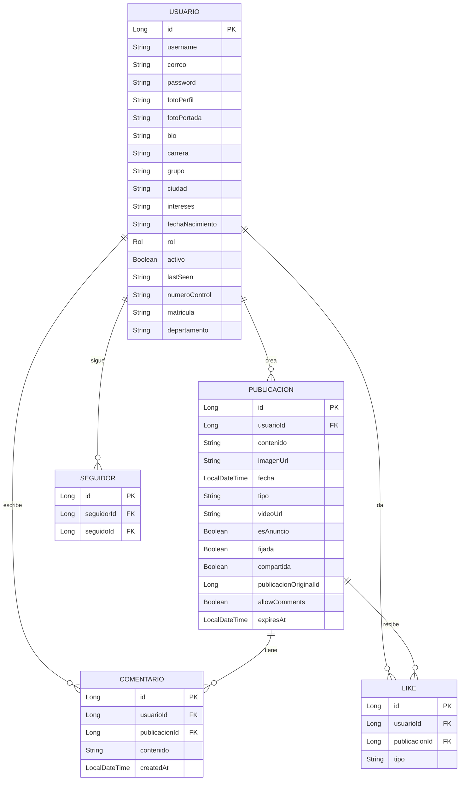
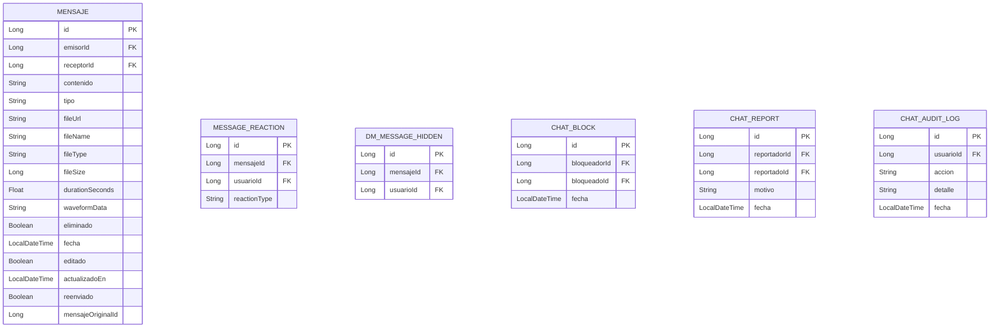
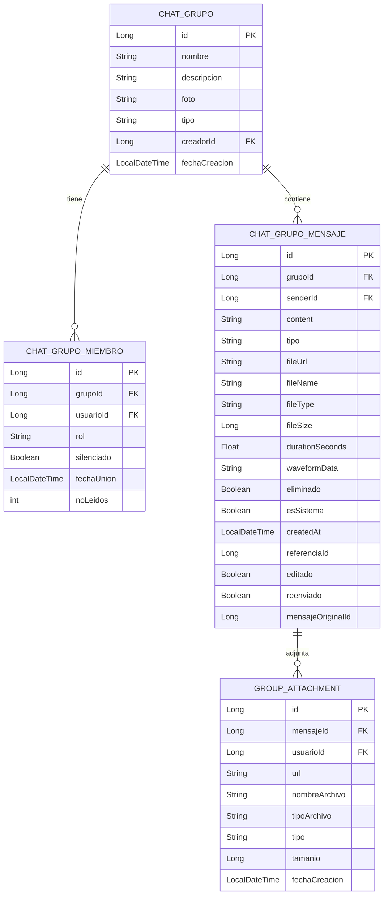
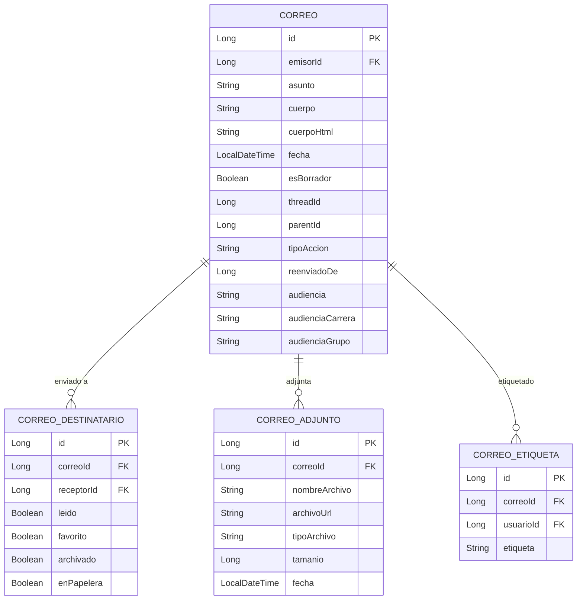

# Entidades Principales — Base de Datos

> Motor: MariaDB (compatible MySQL)
> Esquema: `tesvg_red_social`
> ORM: Spring Data JPA / Hibernate
> DDL: `spring.jpa.hibernate.ddl-auto=update`

---

## Diagrama de Entidades Core

---

## Entidades de Chat (DM)

---

## Entidades de Chat Grupos

---

## Entidades de Correo

---

## Otras Entidades Importantes

### Social
| Entidad | Descripción |
|---|---|
| `GrupoSocial` | Grupos/comunidades de usuarios |
| `GrupoMiembro` | Miembros de grupos sociales |
| `GrupoPublicacion` | Posts dentro de grupos |
| `Story`, `StoryViewer` | Stories tipo Instagram |
| `Notificacion` | Notificaciones del sistema |
| `PushSubscription` | Suscripciones VAPID para push |
| `Favorito` | Correos/posts favoritos |
| `Destacado` | Contenido destacado |

### Marketplace
| Entidad | Descripción |
|---|---|
| `Producto` | Producto en venta |
| `SolicitudCompra` | Solicitud de compra |

### Institucional
| Entidad | Descripción |
|---|---|
| `Evento` | Eventos académicos |
| `Aviso` | Avisos institucionales |
| `Recurso` | Recursos educativos |
| `Encuesta`, `EncuestaOpcion`, `EncuestaVoto` | Sistema de encuestas |
| `Reclutamiento`, `SolicitudReclutamiento` | Reclutamiento estudiantil |
| `CodigoRegistro` | Códigos de acceso para registro |
| `Reporte` | Reportes de contenido |
| `Insignia`, `UsuarioInsignia` | Sistema de logros |
| `BuzonOficial`, `BuzonMiembro` | Buzones institucionales |

---

## Notas Técnicas

- Jackson: `write-dates-as-timestamps=false` → `LocalDateTime` serializa como ISO string
- Posts y comentarios NO embedden autor — join manual con lista de usuarios
- `archivoUrl` de adjuntos bloqueado en `SecurityConfig` (`denyAll()`)
- DDL auto en `update` — Hibernate crea columnas nuevas automáticamente

Ver: [[02-Backend/Endpoints-API]] | [[04-BaseDeDatos/Configuracion-DB]]
