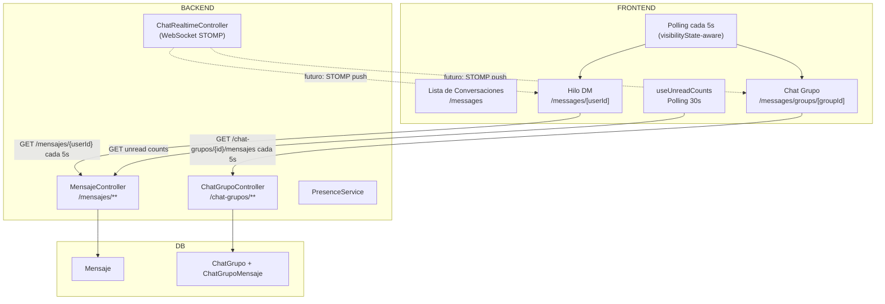

# Chat — Arquitectura

## Diagrama de Flujo del Chat



## Tipos de Chat

### 1. Chat DM (Mensajes Directos)
- Entre dos usuarios
- Ruta: `/messages/[userId]`
- Controller: `MensajeController` en `/mensajes`

### 2. Chat Grupos
- Múltiples participantes
- Roles: `ADMIN`, `MODERADOR`, `MIEMBRO`
- Tipos de grupo: `PUBLICO`, `PRIVADO`, `SECRETO`
- Ruta: `/messages/groups/[groupId]`
- Controller: `ChatGrupoController` en `/chat-grupos`

## Estado Actual de Implementación

| Feature | Estado |
|---|---|
| DM — enviar/recibir texto | ✅ |
| DM — enviar imágenes | ✅ |
| DM — enviar archivos | ✅ |
| DM — enviar audios | ✅ |
| DM — responder mensajes (reply) | ✅ |
| DM — reacciones | ✅ |
| DM — editar mensaje | ✅ |
| DM — eliminar mensaje | ✅ |
| DM — reenviar mensaje | ✅ |
| Grupos — CRUD grupos | ✅ |
| Grupos — enviar texto | ✅ |
| Grupos — enviar archivos | ✅ |
| Grupos — roles (admin/mod) | ✅ |
| Grupos — menciones | ⚠️ Parcial |
| WebSocket STOMP realtime | 🔜 Fase 4 |
| Indicador de escritura (typing) | 🔜 Fase 4 |
| Read receipts | 🔜 Fase 4 |

## Polling vs WebSocket

### Situación Actual: Polling
```typescript
// Chat thread hace polling cada 5s
// Solo cuando la pestaña está activa (visibilityState)
const interval = setInterval(() => {
  if (document.visibilityState === 'visible') {
    fetchMessages();
  }
}, 5000);
```

### Situación Futura: WebSocket STOMP
```
Backend: WebSocketConfig.java → /ws (SockJS)
Frontend: @stomp/stompjs (pendiente de instalar)

El frontend actual usa WebSocket NATIVO — INCOMPATIBLE con STOMP.
La migración requiere reemplazar useSocket.ts por cliente STOMP.
```

## Tipos de Mensajes

| Tipo | Descripción |
|---|---|
| `texto` | Mensaje de texto plano |
| `imagen` | Imagen (con thumbnail) |
| `audio` | Audio con waveform y duración |
| `archivo` | Archivo genérico (pdf, doc, zip, etc.) |
| `video` | Video |

## Estructura de Audio

```typescript
{
  tipo: 'audio',
  fileUrl: string,          // URL del audio
  durationSeconds: number,  // duración en segundos
  waveformData: string,     // JSON de forma de onda para visualización
}
```

## Características de Mensajes

- **Reply preview**: referencia al mensaje respondido
- **Reactions**: emoji reactions por mensaje
- **Edición**: mensajes editados muestran indicador
- **Eliminación soft**: `eliminado: true`, contenido oculto
- **Reenvío**: `reenviado: true` + `mensajeOriginalId`

Ver: [[Chat-DM]] | [[Chat-Grupos]] | [[Chat-WebSocket-Futuro]]
