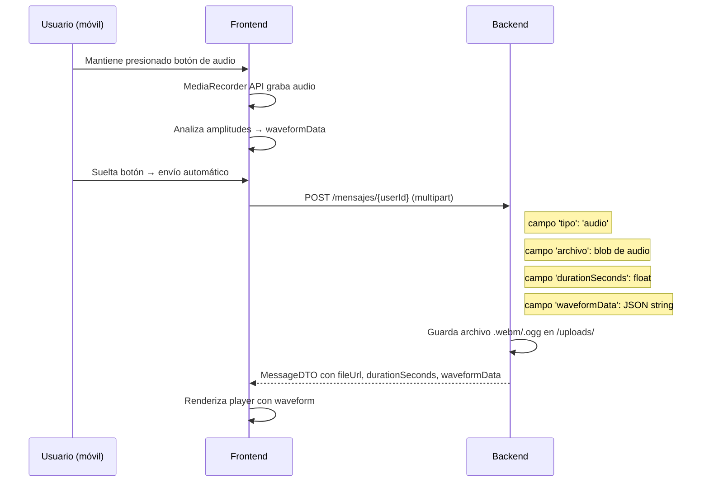

# Chat — Mensajes de Audio

## Descripción

FalconNet soporta mensajes de voz/audio en ambos tipos de chat (DM y grupos) con visualización de waveform y controles de reproducción.

## Estructura de Datos

```typescript
{
  tipo: 'audio',
  fileUrl: string,          // URL del archivo de audio
  durationSeconds: number,  // duración en segundos
  waveformData: string,     // JSON string con array de amplitudes [0-1]
}
```

## Flujo de Grabación y Envío



## Reproductor de Audio

El reproductor muestra:
- Waveform visual (barras de amplitud)
- Duración total
- Progreso de reproducción
- Botón play/pause
- Tiempo actual

## Formatos Soportados

- `.webm` (Chrome, Android)
- `.ogg` (Firefox)
- `.m4a` / `.mp4` (Safari iOS)

## Soporte iOS

Safari iOS tiene restricciones en `MediaRecorder`:
- No soporta `.webm`
- Requiere `.mp4`/`.m4a`
- El frontend detecta el formato correcto según el browser

## Consideraciones

- La waveform se genera en el frontend durante la grabación
- Se almacena como JSON string en la DB (array de flotantes)
- Los controles táctiles están optimizados para uso móvil
- La reproducción de audio es simultánea — solo un audio a la vez

## Pendientes

- [ ] Transcripción automática de audio (AI)
- [ ] Waveform más precisa (más puntos de muestreo)
- [ ] Velocidad de reproducción (1x, 1.5x, 2x)
