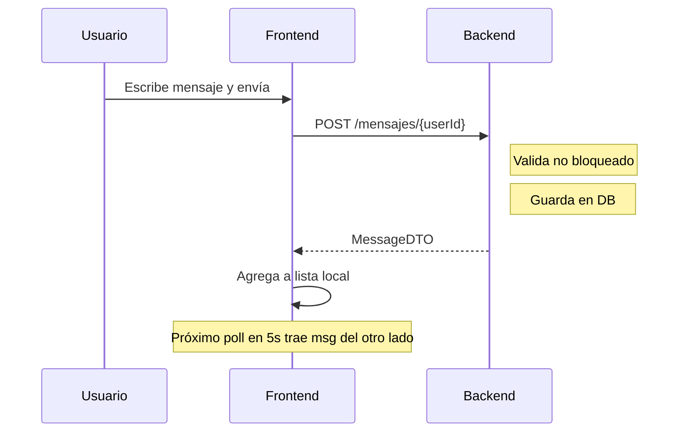

# Chat DM (Mensajes Directos)

## Descripción

El chat DM permite conversaciones privadas uno-a-uno entre cualquier par de usuarios de FalconNet.

## Rutas

| Ruta | Descripción |
|---|---|
| `/messages` | Lista de todas las conversaciones |
| `/messages/[userId]` | Hilo de conversación con un usuario |

## Endpoints

| Método | Endpoint | Descripción |
|---|---|---|
| GET | `/mensajes/conversaciones` | Lista de conversaciones (con último mensaje) |
| GET | `/mensajes/{userId}?page=&size=` | Mensajes con un usuario (paginado) |
| POST | `/mensajes/{userId}` | Enviar mensaje (text o multipart con archivo) |
| DELETE | `/mensajes/{id}` | Eliminar mensaje (soft delete) |
| PUT | `/mensajes/{id}` | Editar mensaje |
| POST | `/mensajes/{id}/reaccion` | Agregar reacción |
| DELETE | `/mensajes/{id}/reaccion` | Quitar reacción |

## Modelo de Datos

### Entidad `Mensaje`
```
id, emisorId, receptorId
contenido, tipo (texto|imagen|audio|archivo|video)
fileUrl, fileName, fileType, fileSize
durationSeconds, waveformData
eliminado, fecha
editado, actualizadoEn
reenviado, mensajeOriginalId
```

### Entidades Relacionadas
- `MessageReaction` — reacciones por mensaje y usuario
- `DMMessageHidden` — mensajes ocultos para un usuario
- `DMConversationPreference` — preferencias de conversación
- `ChatBlock` — usuarios bloqueados
- `ChatReport` — reportes
- `ChatAuditLog` — auditoría de acciones

## Flujo de Envío de Mensaje



## Flujo de Archivo/Audio

```
1. Usuario selecciona archivo
2. FE: POST /mensajes/{userId} (multipart form-data)
   - campo 'tipo': 'audio'|'imagen'|'archivo'
   - campo 'archivo': file
3. BE: guarda archivo en /uploads/
4. BE: guarda URL en Mensaje.fileUrl
5. BE: devuelve MessageDTO con fileUrl
```

## Seguridad

- Solo los participantes pueden ver sus mensajes
- Bloqueo: `ChatBlock` previene envío entre usuarios bloqueados
- `DMMessageHidden`: cada usuario puede ocultar mensajes sin afectar al otro

## Pendientes

- [ ] WebSocket STOMP (Fase 4) — reemplazar polling por push
- [ ] Indicador de escritura (typing indicator)
- [ ] Read receipts (leído/no leído por mensaje)
- [ ] Búsqueda dentro de conversaciones
- [ ] Mensajes de voz mejorados (transcripción)

Ver: [[Chat-Arquitectura]] | [[Chat-WebSocket-Futuro]]
