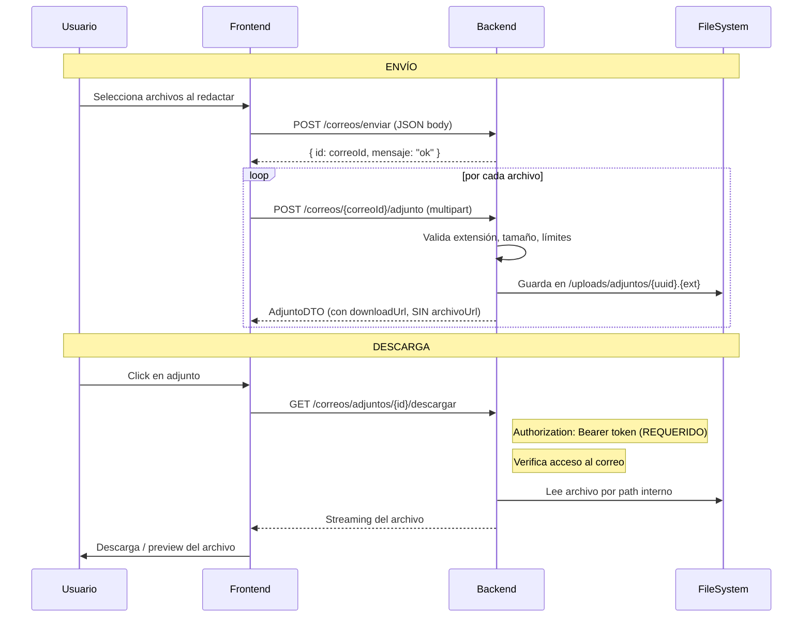

# Correo — Adjuntos

## Flujo Completo de Adjuntos



## Validaciones de Seguridad

### Límites por Correo
| Límite | Valor |
|---|---|
| Máx adjuntos por correo | 6 |
| Máx tamaño por archivo | 25 MB |
| Máx tamaño total | 100 MB |

### Extensiones Bloqueadas
```
exe, bat, cmd, vbs, js, jar, sh, ps1, dll, scr, com, pif, reg, vbe, wsf, hta, msi
```

### Extensiones Permitidas (Whitelist)
```
Documentos: pdf, doc, docx, xls, xlsx, ppt, pptx, txt
Imágenes:   png, jpg, jpeg, gif, webp
Multimedia: mp4, mov, webm
Comprimidos: zip
```

### Sanitización de Nombres
- Caracteres de path traversal eliminados (`../`, `..\\`)
- Patrón `SAFE_NAME_PATTERN` aplicado
- Nombre máximo 200 caracteres
- UUID como nombre de archivo en disco (no el nombre original)

## Acceso Seguro

```
/imagenes/adjuntos/**  →  denyAll()  ← NO accesible directamente
/correos/adjuntos/{id}/descargar  →  JWT requerido
```

El backend:
1. Valida token JWT
2. Verifica que el usuario tiene acceso al correo
3. Lee el archivo por path interno
4. Hace streaming del archivo con headers apropiados

## CorreoAdjunto Entity

```
id              Long
correoId        Long (FK)
nombreArchivo   String  ← nombre original (para mostrar al usuario)
archivoUrl      String  ← path interno /uploads/adjuntos/{uuid}.{ext} (NUNCA en API)
tipoArchivo     String  ← MIME type
tamanio         Long    ← en bytes
fecha           LocalDateTime
```

## AdjuntoDTO (respuesta API)

```json
{
  "id": 42,
  "nombreArchivo": "informe_final.pdf",
  "downloadUrl": "/correos/adjuntos/42/descargar",
  "tipoArchivo": "application/pdf",
  "tamanio": 524288,
  "fecha": "2026-05-28T10:30:00"
}
```

`archivoUrl` NUNCA aparece en este DTO.

## Frontend — MailDetail.tsx

```typescript
// Solo usa downloadUrl con JWT
const downloadAttachment = async (adjunto: AdjuntoDTO) => {
  const response = await fetch(adjunto.downloadUrl, {
    headers: { Authorization: `Bearer ${token}` }
  });
  // Descarga o abre el archivo
};
```

## Repositorios Específicos

- `CorreoAdjuntoRepository.countByCorreoId(correoId)` — cuenta adjuntos
- `CorreoAdjuntoRepository.sumTamanioByCorreoId(correoId)` — suma tamaño total

Usados para validar límites antes de cada upload.
