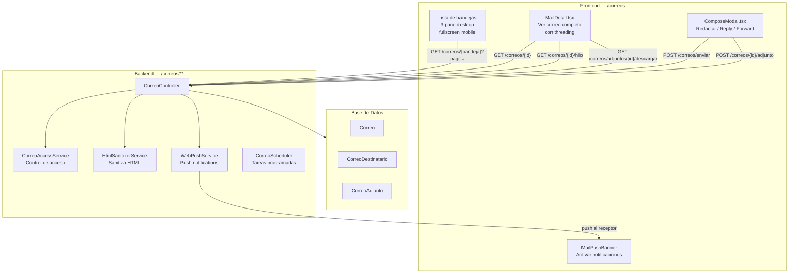

# Correo Institucional — Arquitectura

## Descripción

El módulo de correo institucional de FalconNet permite comunicación formal entre miembros del TESVG. Es **completamente separado del chat** — diferentes entidades, endpoints y UI.

## Diagrama de Flujo del Correo



## Bandejas Disponibles

| Bandeja | Endpoint | Descripción |
|---|---|---|
| Entrada | `GET /correos/entrada` | Correos recibidos |
| Enviados | `GET /correos/enviados` | Correos enviados |
| Favoritos | `GET /correos/favoritos` | Marcados con estrella |
| No leídos | `GET /correos/no-leidos/lista` | Sin leer |
| Archivados | `GET /correos/archivados` | Archivados |
| Papelera | `GET /correos/papelera` | Eliminados |
| Categorías | `GET /correos/categoria/{cat}` | Por categoría personalizada |

Todos los endpoints de bandeja aceptan `?page=0&size=20` (máx size=50).

## Layout del Frontend

### Desktop (≥768px)
```
┌──────────┬──────────────────┬──────────────────────┐
│ Sidebar  │  Lista de correos│    Detalle            │
│ Bandejas │  (scroll)        │    del correo         │
│          │                  │    seleccionado       │
└──────────┴──────────────────┴──────────────────────┘
```

### Mobile (<768px)
```
Pantalla 1: Lista de correos (fullscreen)
    ↓ tap en correo
Pantalla 2: Detalle del correo (slide-in)
    ↓ tap en atrás
Pantalla 1: Lista

FAB (✏️) → abre ComposeModal
Hamburger (☰) → abre drawer con bandejas
```

## Modelo de Correo

### Correo Base
```
threadId — null para nuevo hilo, id del correo raíz para replies
parentId — null para nuevo hilo, id del correo padre
tipoAccion — null | RESPUESTA | RESPUESTA_TODOS | REENVIO
reenviadoDe — id del correo original si es reenvío
```

### Threading Model
```
Correo nuevo (raíz):
  threadId = null
  parentId = null
  tipoAccion = null

Reply (respuesta):
  threadId = original.threadId ?? original.id
  parentId = original.id
  tipoAccion = RESPUESTA

Reply-All:
  threadId = original.threadId ?? original.id
  parentId = original.id
  tipoAccion = RESPUESTA_TODOS
  destinatarios = emisor original + todos los destinatarios

Forward (reenvío):
  threadId = null (nuevo hilo)
  parentId = null
  tipoAccion = REENVIO
  reenviadoDe = original.id
  cuerpo = prefilled con contenido citado
```

## Seguridad de Adjuntos

- `/imagenes/adjuntos/**` → `denyAll()` en SecurityConfig
- Solo acceso via `GET /correos/adjuntos/{id}/descargar` con JWT
- `archivoUrl` NUNCA aparece en respuestas API
- `AdjuntoDTO` solo expone `downloadUrl`

## Identidad Institucional

`GET /correos/identidad` devuelve tarjeta completa del usuario:
- Nombre, carrera, semestre, grupo, matrícula
- Número de control, departamento, facultad
- Verificación `@tesvg.edu.mx`
- `rolLabel` en español (Estudiante, Docente, Coordinación...)

## Push Notifications para Correo

Al enviar correo (no borrador):
1. Backend llama `WebPushService.sendMailNotification()` por cada receptor
2. Payload: `{ type: "mail", title: "Nuevo correo", body: "emisor: asunto", url: "/correos?tab=entrada", tag: "mail-{id}" }`
3. Service Worker (`sw.js`) muestra notificación con renotify=true
4. Click en notificación → navega a `/correos?tab=entrada&correoId=X`

Ver: [[Correo-Bandejas]] | [[Correo-Adjuntos]] | [[Correo-Threading]] | [[Correo-Push-Notifications]]
