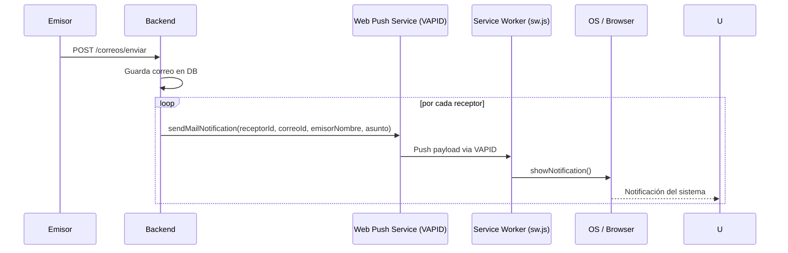

# Correo — Push Notifications

## Descripción

Las push notifications para correo permiten que los usuarios reciban notificaciones del sistema operativo cuando llega un correo nuevo, incluso con FalconNet cerrado.

## Arquitectura



## Payload de Push

```json
{
  "type": "mail",
  "title": "Nuevo correo institucional",
  "body": "Roberto Benhumea: Reunión del proyecto final",
  "url": "/correos?tab=entrada",
  "correoId": 42,
  "tag": "mail-42"
}
```

- `tag: "mail-{id}"` reemplaza notificaciones del mismo correo (renotify=true)
- `url` es la ruta a abrir al hacer click
- NO se envía si `esBorrador=true`

## Service Worker (public/sw.js)

```javascript
// Handler de push
self.addEventListener('push', event => {
  const data = event.data.json();
  if (data.type === 'mail') {
    self.registration.showNotification(data.title, {
      body: data.body,
      tag: data.tag,
      renotify: true,
      data: { url: data.url, correoId: data.correoId }
    });
  }
});

// Click en notificación
self.addEventListener('notificationclick', event => {
  const url = event.notification.data.url;
  const correoId = event.notification.data.correoId;
  // navega a /correos?tab=entrada&correoId={correoId}
  clients.openWindow(`${url}&correoId=${correoId}`);
});
```

## MailPushBanner

Componente en `/correos/page.tsx` que aparece cuando el usuario no tiene push habilitado:
- Botón "Activar notificaciones de correo"
- Se descarta permanentemente via `localStorage['falconnet_mail_push_banner_dismissed']`
- No vuelve a mostrarse una vez descartado

## Endpoints Push

| Método | Endpoint | Descripción |
|---|---|---|
| GET | `/push/status` | `{ subscribed: boolean, count: number }` |
| POST | `/push/subscribe` | Registra suscripción VAPID + guarda User-Agent |
| DELETE | `/push/unsubscribe` | Cancela suscripción |

## PushSubscription Entity

```
id, userId, endpoint
p256dh (llave pública cliente)
auth (secret de autenticación)
userAgent (guardado al suscribir)
createdAt
active
```

## Funciones en mailPush.ts

```typescript
enableMailPush()    // solicita permiso + suscribe a push
disableMailPush()   // cancela suscripción
getMailPushStatus() // GET /push/status
```

## VAPID Keys

- Pública: `app.vapid.public-key` (env var)
- Privada: `app.vapid.private-key` (env var)
- Subject: `app.vapid.subject=mailto:nido@tesvg.edu.mx`

> Las keys de producción deben ser distintas a las de desarrollo.

## Nota: Push cubre correo y general

La misma suscripción push cubre tanto correo como notificaciones generales del sistema. El toggle en `/settings` habilita/deshabilita todo tipo de push.
