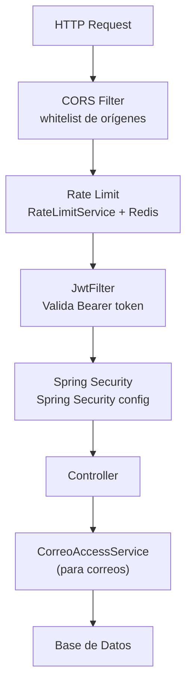

# Seguridad — Overview

## Capas de Seguridad



## Spring Security Config

### Rutas Públicas (sin JWT)
```
POST /usuarios/login
POST /usuarios/registro
GET  /imagenes/** (excepto /imagenes/adjuntos/**)
```

### Rutas Bloqueadas
```
GET /imagenes/adjuntos/**  →  denyAll()
```

### Rutas Protegidas por Rol
```
/admin/**  →  ADMIN
Avisos masivos  →  AUTORIDAD | DIRECCION | ADMIN
```

## JWT

- Algoritmo: HS256
- Secret: variable de entorno `JWT_SECRET`
- Sin expiración configurada en dev (⚠️ configurar en prod)
- Payload: `userId`, `correo`, `rol`

## Seguridad de Adjuntos

El acceso a archivos adjuntos de correo es la implementación de seguridad más robusta:

1. `/imagenes/adjuntos/**` — `denyAll()` en SecurityConfig
2. Solo acceso via `GET /correos/adjuntos/{id}/descargar` con JWT válido
3. `CorreoAccessService` verifica que el usuario tiene acceso al correo del adjunto
4. El `archivoUrl` interno (path en disco) nunca se incluye en respuestas API
5. La URL pública `downloadUrl` solo funciona con JWT

## Rate Limiting

`RateLimitService` usa Redis para limitar peticiones:
- Por IP y/o por usuario
- Configurable por endpoint
- Si Redis no está disponible, puede degradar gracefully

## Validación de Inputs

`spring-boot-starter-validation` (Bean Validation):
- `EnviarCorreoRequest` tiene `@NotBlank`, `@Size`, `@Pattern`
- Extensiones de archivos validadas en whitelist
- Nombres de archivos sanitizados (path traversal prevention)

## CORS

```java
allowedOrigins: localhost:3000, localhost:3001, localhost:8080
               192.168.*.*, 10.*.*.*, 172.16.*.*
allowedMethods: GET, POST, PUT, DELETE, PATCH, OPTIONS
allowedHeaders: *
allowCredentials: true
```

## Sanitización HTML

`HtmlSanitizerService` limpia HTML de correos antes de guardar en DB:
- Previene XSS en correos con `cuerpoHtml`
- Solo permite tags HTML seguros (p, br, b, i, ul, li, etc.)
- Elimina scripts, iframes, event handlers

## Auditoría

`ChatAuditLog` registra acciones en el chat:
- Bloqueos
- Reportes
- Eliminaciones masivas

## Pendientes de Seguridad

- [ ] JWT expiration configurado (actualmente sin expirar en dev)
- [ ] Refresh tokens
- [ ] Rate limiting más granular por endpoint
- [ ] 2FA para roles ADMIN/DIRECCION
- [ ] Logs de acceso a correos (auditoría)
- [ ] HTTPS en producción (via Nginx + Cloudflare)

Ver: [[01-Arquitectura/Flujo-JWT]] | [[16-Infraestructura-Futura/Plan-Infraestructura]]
