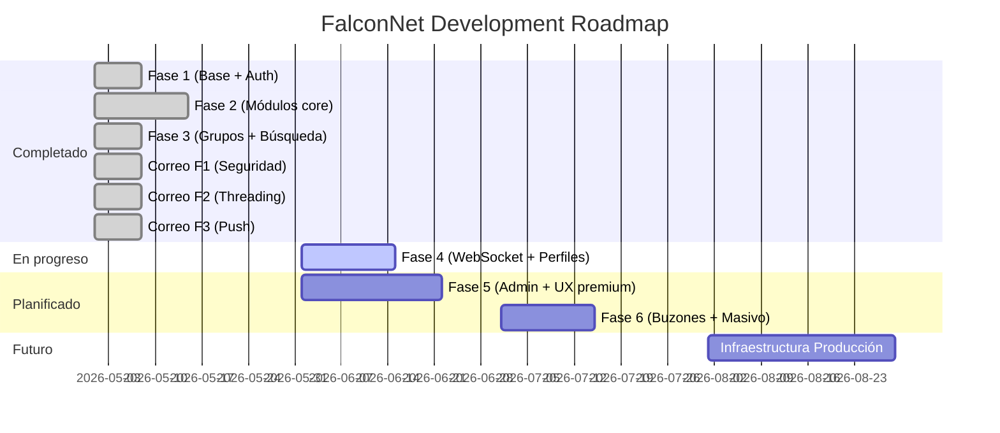

# Roadmap Principal de FalconNet

> Fecha de referencia: 2026-06-05
> Estado: Fase 3 completada, Fase 4 en progreso

---

## Vista General

---

## P0 — Crítico (Fase 4 actual)

| Tarea | Módulo | Estado |
|---|---|---|
| Migrar chat a WebSocket STOMP | Chat | 🔜 |
| Instalar `@stomp/stompjs` en frontend | Chat | 🔜 |
| Reescribir `useSocket.ts` con STOMP | Chat | 🔜 |
| Reemplazar polling en chat DM | Chat | 🔜 |
| Reemplazar polling en chat grupos | Chat | 🔜 |
| Typing indicators | Chat | 🔜 |
| Read receipts | Chat | 🔜 |
| Editar perfil en /settings | Perfiles | 🔜 |

## P1 — Importante

| Tarea | Módulo | Estado |
|---|---|---|
| Panel de administración completo | Admin | ⚠️ |
| Buzones oficiales (`BuzonOficial`) | Correo | 🔜 |
| Destinatarios masivos (por carrera/grupo) | Correo | 🔜 |
| Borradores de correo (UI) | Correo | 🔜 |
| Notificaciones push para mensajes de chat | Chat | 🔜 |
| Búsqueda dentro de correos | Correo | 🔜 |
| Menciones en grupos (@usuario) | Chat | 🔜 |

## P2 — Mejoras

| Tarea | Módulo | Estado |
|---|---|---|
| Encuestas completas (UI) | Feed | 🔜 |
| Videos en feed | Feed | 🔜 |
| Filtros avanzados en marketplace | Marketplace | 🔜 |
| Categorías de correo (UI) | Correo | 🔜 |
| Historial de ventas en marketplace | Marketplace | 🔜 |
| App badge en PWA | PWA | 🔜 |
| Background sync offline | PWA | 🔜 |
| JWT expiration + refresh tokens | Seguridad | 🔜 |

## P3 — Nice to Have

| Tarea | Módulo | Status |
|---|---|---|
| Transcripción de audios | Chat | 🔜 |
| Velocidad de reproducción audio | Chat | 🔜 |
| Open Graph preview en mensajes | Chat | 🔜 |
| Gif support en chat | Chat | 🔜 |
| Correos programados | Correo | 🔜 |
| Plantillas de correo | Correo | 🔜 |
| 2FA para admins | Seguridad | 🔜 |
| Dark/light mode toggle en perfil | UI | 🔜 |

---

## Fase Actual — Fase 4

Ver: [[Fase-Actual]]

## Fase Siguiente — Fase 5

Ver: [[Fase-Siguiente]]

## Infraestructura Futura

Ver: [[16-Infraestructura-Futura/Plan-Infraestructura]]
