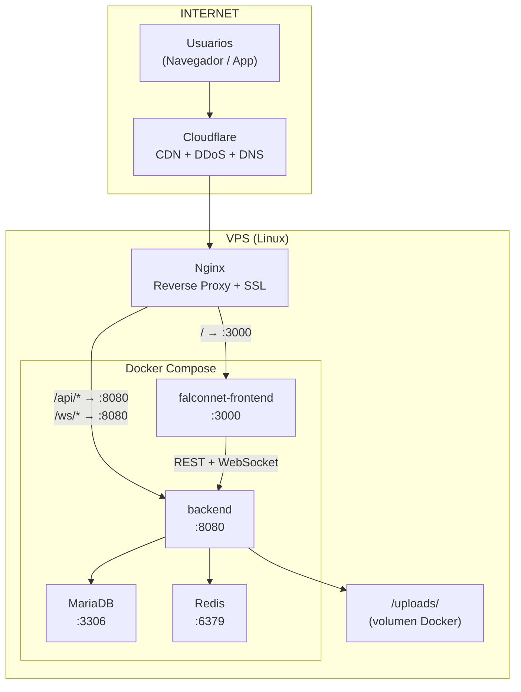

# Plan de Infraestructura Futura

> Estado: Planificado — se implementa cuando las funcionalidades estén estabilizadas
> Ver decisión: [[15-Decisiones/Decisiones-Arquitectura#DEC-001]]

---

## Arquitectura Objetivo de Producción



---

## Docker Compose

### docker-compose.yml (objetivo)
```yaml
version: '3.8'
services:
  frontend:
    build: ./falconnet-frontend
    ports: ["3000:3000"]
    environment:
      - NEXT_PUBLIC_API_URL=https://falconnet.tesvg.edu.mx

  backend:
    build: ./backend
    ports: ["8080:8080"]
    environment:
      - DB_URL=jdbc:mariadb://db:3306/tesvg_red_social
      - JWT_SECRET=${JWT_SECRET}
      - REDIS_HOST=redis
      - UPLOAD_DIR=/uploads
    volumes:
      - uploads:/uploads
    depends_on: [db, redis]

  db:
    image: mariadb:11
    environment:
      - MARIADB_ROOT_PASSWORD=${DB_PASSWORD}
      - MARIADB_DATABASE=tesvg_red_social
    volumes:
      - db_data:/var/lib/mysql

  redis:
    image: redis:7-alpine
    command: redis-server --requirepass ${REDIS_PASSWORD}

volumes:
  db_data:
  uploads:
```

### Existente
`docker-compose.redis.yml` ya existe en el repositorio — solo levanta Redis.

---

## Nginx Config

```nginx
server {
    listen 443 ssl;
    server_name falconnet.tesvg.edu.mx;

    ssl_certificate /etc/letsencrypt/live/falconnet.tesvg.edu.mx/fullchain.pem;
    ssl_certificate_key /etc/letsencrypt/live/falconnet.tesvg.edu.mx/privkey.pem;

    # Frontend (Next.js)
    location / {
        proxy_pass http://localhost:3000;
        proxy_http_version 1.1;
        proxy_set_header Upgrade $http_upgrade;
        proxy_set_header Connection 'upgrade';
        proxy_set_header Host $host;
    }

    # Backend API
    location /api/ {
        proxy_pass http://localhost:8080/;
        proxy_set_header Authorization $http_authorization;
    }

    # WebSocket (STOMP/SockJS)
    location /ws {
        proxy_pass http://localhost:8080/ws;
        proxy_http_version 1.1;
        proxy_set_header Upgrade $http_upgrade;
        proxy_set_header Connection "Upgrade";
    }

    # Uploads directos (imágenes públicas)
    location /uploads/imagenes/ {
        alias /uploads/imagenes/;
        expires 30d;
    }
}
```

---

## Cloudflare

- Configurar DNS: `A falconnet.tesvg.edu.mx → IP del VPS`
- Habilitar Proxy (orange cloud) para CDN + DDoS
- Configurar SSL: Full (strict)
- Page Rules para cache de assets estáticos
- Rate limiting a nivel Cloudflare para protección adicional

---

## Variables de Entorno de Producción

| Variable | Descripción |
|---|---|
| `JWT_SECRET` | Secret largo y aleatorio (min 64 chars) |
| `DB_PASSWORD` | Contraseña fuerte para MariaDB |
| `REDIS_PASSWORD` | Contraseña para Redis |
| `VAPID_PUBLIC_KEY` | Nueva VAPID key pública (generar nueva) |
| `VAPID_PRIVATE_KEY` | Nueva VAPID key privada |
| `UPLOAD_DIR` | `/uploads` (en Docker) |
| `CORS_ALLOWED_ORIGINS` | `https://falconnet.tesvg.edu.mx` |
| `JPA_DDL_AUTO` | `validate` (no `update` en prod) |
| `REDIS_ENABLED` | `true` |

---

## Checklist de Producción

```
Infraestructura:
  [ ] VPS provisionado (Ubuntu 22.04+)
  [ ] Docker + Docker Compose instalados
  [ ] Dominio apuntando al VPS

Seguridad:
  [ ] SSL con Let's Encrypt (certbot)
  [ ] JWT_SECRET cambiado (no el default de dev)
  [ ] DB_PASSWORD cambiado
  [ ] JPA_DDL_AUTO=validate
  [ ] show-sql=false
  [ ] Firewall: solo 80, 443, 22 abiertos

Backend:
  [ ] Variables de entorno de prod configuradas
  [ ] Backup de base de datos configurado

Frontend:
  [ ] NEXT_PUBLIC_API_URL apuntando a prod
  [ ] Build de producción probado

Monitoreo:
  [ ] Logs configurados
  [ ] Alertas de uptime
  [ ] Métricas de performance
```
