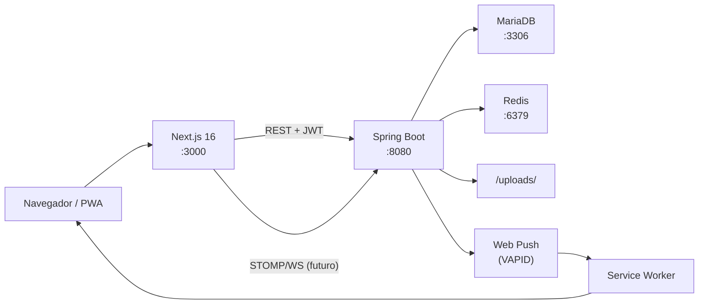
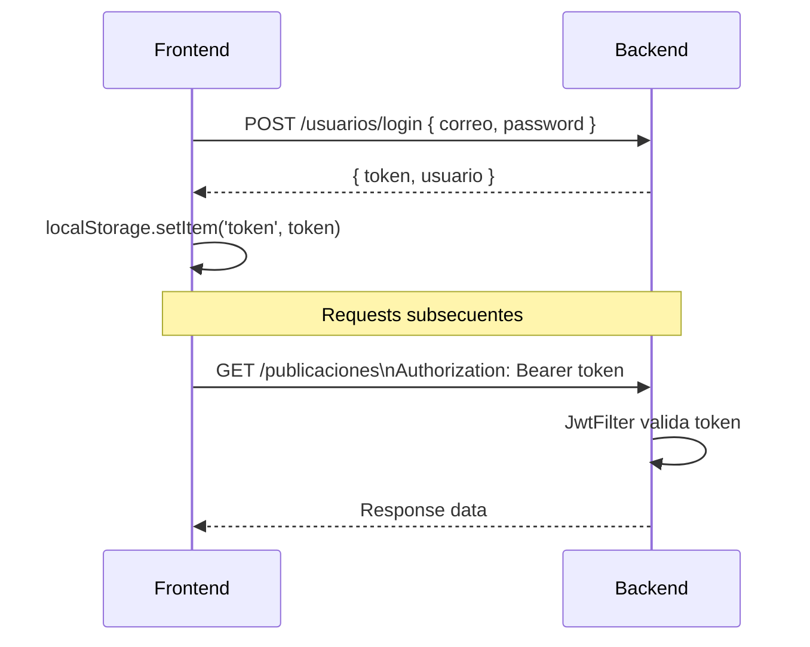
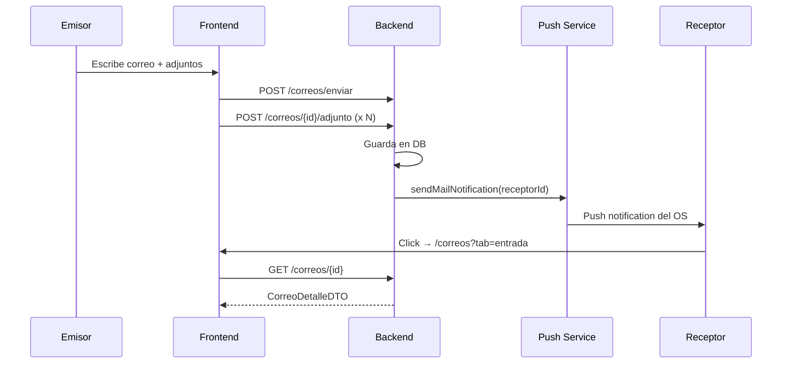
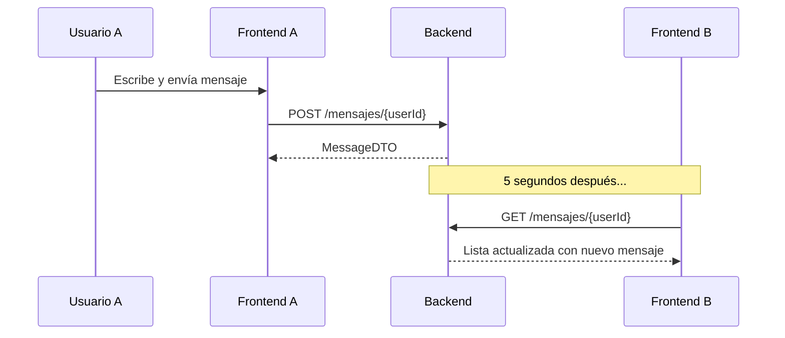
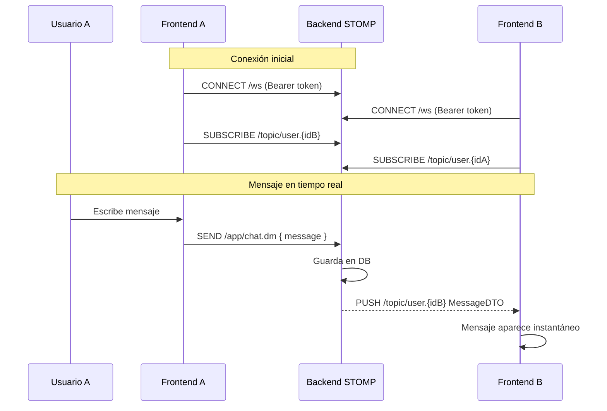
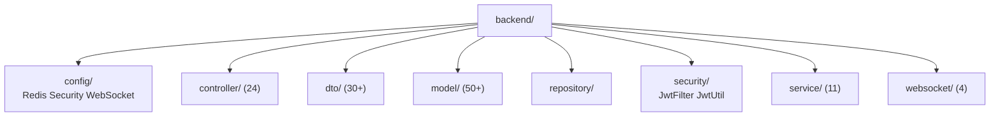
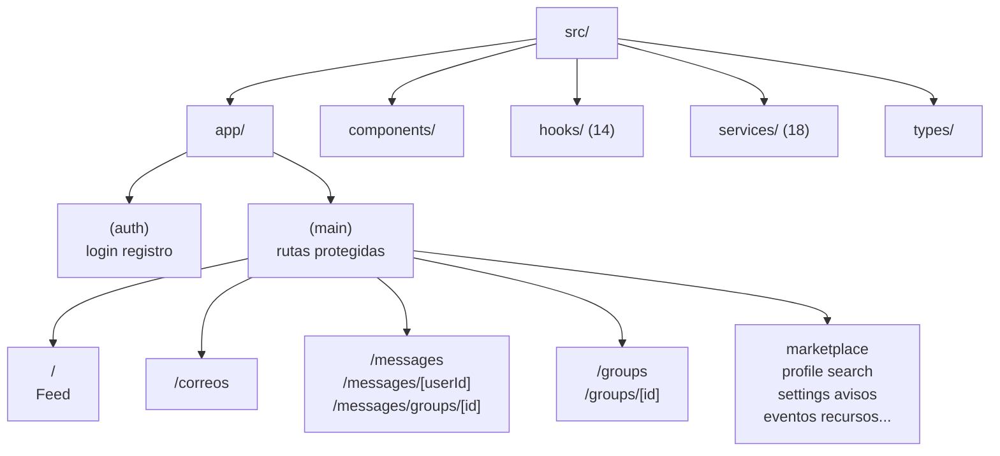
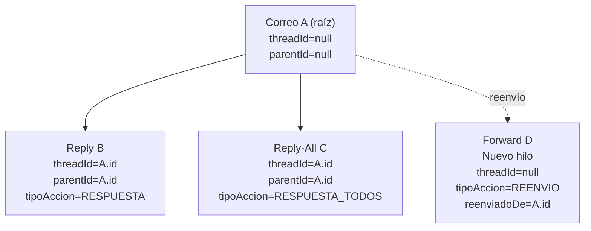

# Diagramas Mermaid — Referencia Rápida

## 1. Arquitectura General

## 2. Flujo JWT Simplificado

## 3. Flujo de Correo (Envío y Notificación)

## 4. Flujo de Chat (Estado Actual — Polling)

## 5. Flujo de Chat (Futuro — WebSocket STOMP)

## 6. Estructura del Backend (Paquetes)

## 7. Estructura del Frontend (Módulos)

## 8. Threading de Correo

